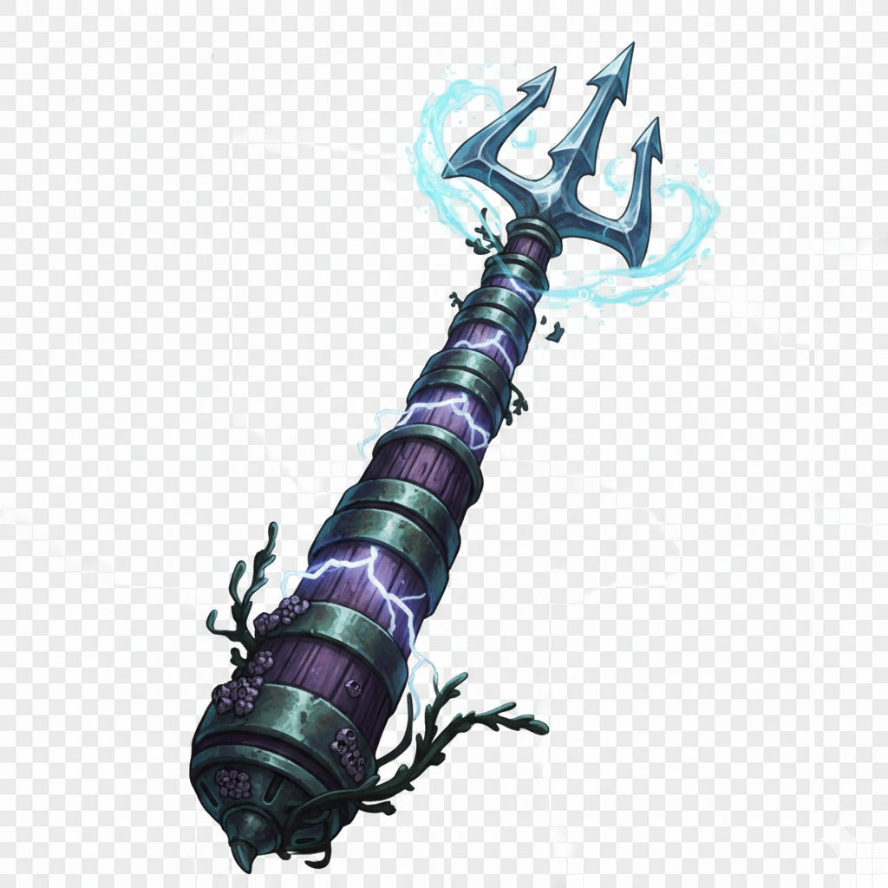

# Trident of Qual’al

Tags: Item
Continent: Biamer
Kingdom: Salindash
Town: Geyser, Port Stillwater
Last Edited: February 1, 2026 12:33 PM
Attunement: Not attuned, Not required
Inventory: Bag of Holding

You gain a +1 bonus to attack and damage rolls made with this magic weapon. The trident deals 2d6 + 1 piercing damage on a hit instead of its normal damage.

- **Thunderwave.** You can use an action to cast the *thunderwave* spell (save DC 15). Once you use this property, you can’t use it again until the next dawn.
- **Tide’s Gift.** Your swimming speed is doubled, to a maximum of 60 feet, and you can breathe underwater.

**Description.** This oversized trident was crafted for a sahuagin baron. Its shaft alternates bands of wood and metal, the wooden grain faintly glowing with violet light that occasionally crackles with lightning from the Elemental Plane of Air. Though barnacles cling to the haft, the triple prongs are pristine, gleaming as if untouched by time.